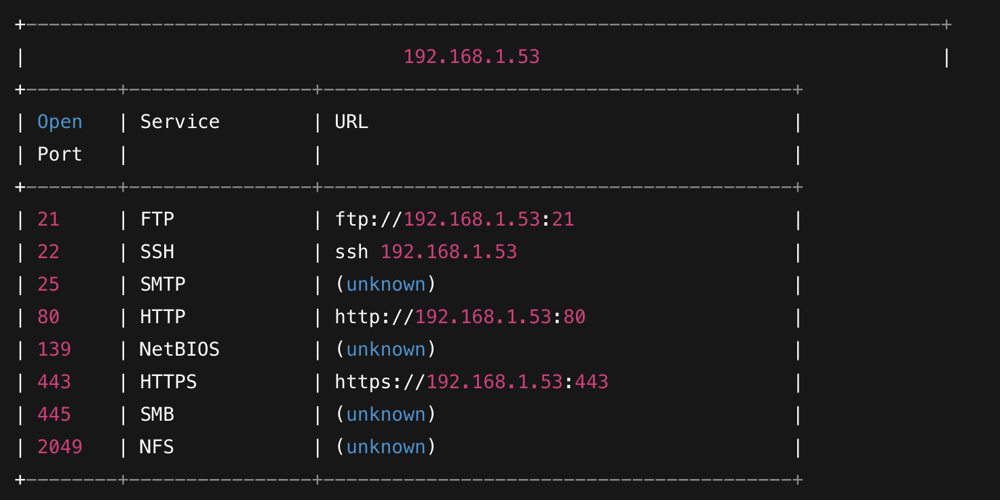

# cnet

> A wireshark-lite terminal UI — see your network without leaving the shell.

[](LICENSE)
[](https://www.rust-lang.org/)
[](#requirements)

`cnet` is a single-binary terminal app for inspecting the network you're on. It captures
live packets, figures out **which devices are around and what they're called** (Bonjour,
DHCP, NetBIOS, TLS SNI, reverse DNS, MAC vendor), and scans your LAN for open ports — all
in one keyboard-driven TUI.

---

## Features

| Tab | What it does |
| --- | --- |
| **1 · Capture** | Live packet list with protocol decode (Ethernet / IPv4 / IPv6 / ARP / TCP / UDP / ICMP), a per-packet layer-detail tree, and a hex+ASCII dump. BPF capture filter with friendly shortcuts. |
| **2 · Hosts** | Device-centric inventory: one row per device, named where possible (falls back to IP). Sortable, filterable, with a drill-down detail page showing every IP, name, service, and a discovery log. |
| **3 · Ports** | LAN port scanner over your /24: discovers live hosts, banner-grabs open ports, maps them to services/URLs, and checks whether a port is reachable from the public internet. |
| **4 · Stats** | Live per-protocol packet/byte breakdown with share bars. |

Switch tabs with `Tab` / `Shift+Tab` or the number keys `1`–`4`. Quit with `q`, `Esc`, or `Ctrl+C`.



---

## Requirements

- **Rust** 1.88+ (2021 edition) — install via [rustup](https://rustup.rs).
- **libpcap** — for live packet capture:
  - **macOS** — ships with the OS, nothing to install.
  - **Debian/Ubuntu** — `sudo apt install libpcap-dev`
  - **Fedora/RHEL** — `sudo dnf install libpcap-devel`
  - **Arch** — `sudo pacman -S libpcap`

Packet capture needs raw-socket access, which means running as root (or granting your user
access to the capture device). The **Ports** tab works without elevated privileges since it
uses ordinary TCP connects; if `cnet` is launched unprivileged, the capture-driven tabs show
a clear "capture unavailable" message and the rest of the app keeps working.

---

## Installation

```sh
# clone and build
git clone https://github.com/isaaclins/cnet.git
cd cnet
cargo build --release

# the binary lands at ./target/release/cnet
```

Or install it onto your `PATH`:

```sh
cargo install --path .
```

---

## Usage

```sh
# full functionality (capture needs root)
sudo ./target/release/cnet
#   or, via the Makefile:
make sudo-run

# unprivileged — Ports tab works, capture tabs show "unavailable"
cnet
```

### Keybindings

**Global**

| Key | Action |
| --- | --- |
| `1`–`4` / `Tab` / `Shift+Tab` | switch tab |
| `q` / `Esc` / `Ctrl+C` | quit |

**Capture tab**

| Key | Action |
| --- | --- |
| `↑` `↓` | select packet |
| `Space` | toggle follow / auto-scroll |
| `End` | jump to newest and follow |
| `f` | edit the capture filter |
| `i` | cycle capture interface |
| `x` | clear buffer + stats |
| `r` | restart capture |
| `c` | copy selected packet summary |

**Hosts tab**

| Key | Action |
| --- | --- |
| `↑` `↓` | select device (works while filtering, too) |
| `Enter` / `→` | open device detail |
| `←` / `Backspace` | back to the list |
| `/` | filter by name / IP / MAC / vendor / service |
| `s` | cycle sort column |
| `S` | flip sort direction |
| `i` `r` `x` | cycle interface / restart / clear |

**Ports tab**

| Key | Action |
| --- | --- |
| `↑` `↓` | navigate |
| `Enter` / `→` | inspect host's ports |
| `←` / `Backspace` | back |
| `/` | filter hosts |
| `c` | copy IP / URL |
| `o` | open URL in browser |
| `r` | rescan the LAN |

### Filter syntax (Capture tab)

The capture filter accepts standard
[BPF capture-filter syntax](https://www.tcpdump.org/manpages/pcap-filter.7.html), plus a few
Wireshark-style shortcuts that are rewritten for you:

```
tcp port 443              # BPF, as-is
host 10.0.0.5 and not arp
proto=ARP                 # → arp
ip.addr==10.0.0.5         # → host 10.0.0.5
tcp.port==22              # → tcp port 22
https   dns   mdns        # named shortcuts → tcp port 443 / port 53 / port 5353
```

If a filter fails to compile, `cnet` reverts to the last working one instead of stopping the
capture.

---

## How device discovery works

The **Hosts** tab builds its inventory passively from whatever traffic it sees. Names and
vendors come from several independent sources:

| Source | Signal | Yields |
| --- | --- | --- |
| Ethernet header | every frame | MAC address + vendor (OUI lookup) |
| ARP | who-has / is-at | confirmed MAC ↔ IPv4 pairing |
| mDNS / Bonjour | UDP 5353 | hostnames + advertised services (`_airplay._tcp`, …) |
| DHCP option 12 | UDP 67/68 | client-announced hostname (keyed by `chaddr`) |
| NetBIOS NS | UDP 137 | Windows machine names |
| TLS SNI | TCP 443/8443 ClientHello | remote hostnames |
| IPv6 EUI-64 | `fe80::…ff:fe…` | recovers the MAC embedded in a link-local address |
| Reverse DNS | async PTR lookups | names for remote IPs |

Each device prefers a clean `.local` hostname for display and falls back to its IP when no
name is known. The detail page lists every name with the source it came from.

> **Note:** what's *inside* an encrypted connection (e.g. the page you loaded over HTTPS) is
> not visible — only metadata like the SNI hostname, which sites send in the clear.

---

## Project layout

```
src/
├── main.rs            # entry point, terminal setup
├── app.rs             # top-level App, tab routing, key dispatch
├── ui.rs              # tab bar + per-tab render delegation
├── capture/           # the wireshark-lite side
│   ├── engine.rs      #   libpcap capture thread → channel
│   ├── parser.rs      #   link/IP/transport packet decoder
│   ├── discovery.rs   #   mDNS / DHCP / NBNS / TLS-SNI extractors
│   ├── devices.rs     #   per-device inventory + aggregation
│   ├── oui.rs         #   MAC → vendor table
│   ├── rdns.rs        #   async reverse-DNS lookups
│   ├── filter.rs      #   friendly → BPF filter translation
│   ├── state.rs       #   capture/hosts/stats UI state + input
│   └── ui.rs          #   capture/hosts/stats rendering
└── scanner/           # the LAN port-scanner side (Ports tab)
    ├── scan.rs        #   async /24 scan + banner grab
    ├── public.rs      #   public-reachability check
    ├── ports.rs       #   port → service/URL maps
    ├── models.rs      #   scan data types
    ├── state.rs       #   scanner UI state + input
    └── ui.rs          #   scanner rendering
```

---

## Development

```sh
make build      # debug build
make release    # optimized build
make test       # run the test suite
make fmt        # cargo fmt
make clippy     # cargo clippy -D warnings
make dev        # cargo run (debug)
```

---

## Disclaimer

`cnet` is a passive network-inspection tool intended for use on networks you own or are
authorized to analyze. Capturing traffic on networks without permission may be illegal in
your jurisdiction. Use responsibly.

---

## License

[MIT](LICENSE) © Isaac Lins
